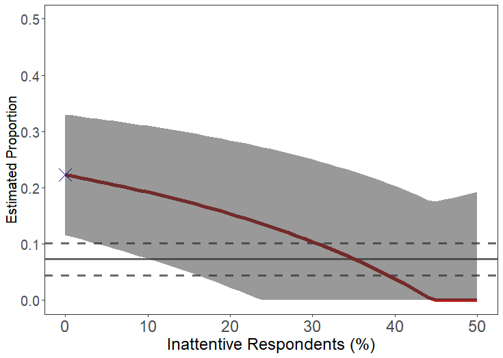
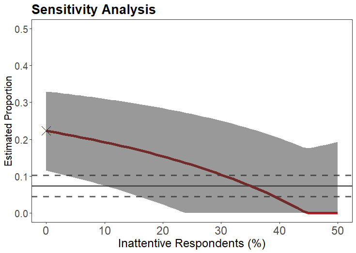
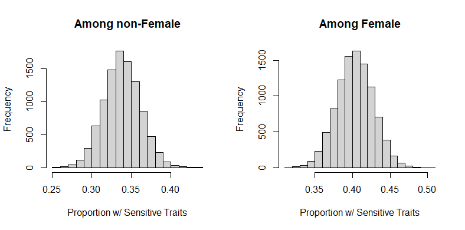
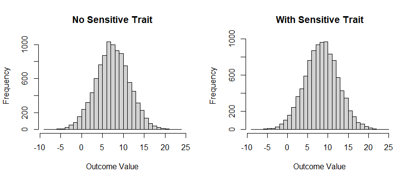

# cWise: A (Cross)Wise Method to Analyze Sensitive Survey Questions 

<!-- badges: start -->

[](https://github.com/cosimameyer/overviewR)
[](https://cran.r-project.org/package=cWise)
[](https://www.gnu.org/licenses/gpl-3.0.en.html)　
<!-- [](https://www.rdocumentation.org/packages/overviewR) -->
<!-- [](https://cran.r-project.org/package=overviewR) -->
<!-- [](https://cran.r-project.org/web/checks/check_results_overviewR.html) -->
<!-- [](https://www.r-pkg.org/badges/version/overviewR) -->
<!-- [](https://www.gnu.org/licenses/gpl-3.0) -->
<!-- [](/commits/master) -->
<!-- badges: end -->


This R package implements the methods proposed by Atsusaka and Stevenson (2020) ["Bias-Corrected Crosswise Estimators for Sensitive Inquiries"](https://github.com/YukiAtsusaka/working-paper/blob/master/WP_BiasCorrectedCM.pdf). Our workhorse function is `bc.est` which generates a bias-corrected crosswise estimate of the proportion of individuals with sensitive attributes. `cmBound` applies our sensitivity analysis to crosswise data without the anchor question. `cmreg` and `cmreg.p` implement crosswise regressions in which the latent sensitive trait can be used as an outcome or as a predictor, respectively. `cmpredict` generates predicted probabilities given specific covariate values with uncertainty estimates via parametric bootstrap. Simulated crosswise data are saved as `cmdata`, `cmdata2`, and `cmdata3`.

<details>
<summary>Cite this software✒️</summary>

@Manual{,
    title = {cWise: A (Cross)Wise Method to Analyze Sensitive Survey Questions},
    author = {Yuki Atsusaka},
    year = {2020},
    note = {R package version 0.0.0},
    url = {https://CRAN.R-project.org/package=cWise},
  }
</details>

## Instllation
To install the latest development version of `cWise` directly from
[GitHub](https://github.com/YukiAtsusaka/cWise) use:

``` r
library(devtools)
devtools::install_github("YukiAtsusaka/cWise")
```

## Example

First, load the package.

``` r
library(cWise)
```

The following examples use a toy data set (`cmdata`) that comes with
the package. This data contains artificially generated information in a survey using the crosswise model.

``` r
data(cmdata)
head(cmdata)

#>   Y A  p      p.prime
#> 1 1 1 0.15    0.15
#> 2 0 0 0.15    0.15
#> 3 0 0 0.15    0.15
#> 4 1 0 0.15    0.15
#> 5 0 1 0.15    0.15
#> 6 1 1 0.15    0.15
```

Here, `Y` is a binary response in the crosswise question (TRUE-TRUE or FALSE-FALSE), and `A` is a binary response in the anchor question. 
`p` and `p.prime` are auxiliary probabilities in the crosswise and anchor questions, respectively.
While researchers can simply remember the values of `p` and `p.prime` (without including them in data), we include them for an illustrative purpose.
Note that `P` and `p.prime` must be (by construction) identical for all respondents.


## `bc.est`: Estimate the Prevalence of Sensitive Attributes
Generate a bias-corrected crosswise estimate using a crosswise data.

```r
prev <- bc.est(Y=Y, A=A, p=0.15, p.prime=0.15, data=cmdata)
prev

#> $Results
#>                 Estimate Std. Error 95%CI(Low) 95%CI(Up)
#> Naive Crosswise   0.2331     0.0126     0.2083    0.2579
#> Bias-Corrected    0.1547     0.0182     0.1193    0.1845
#> 
#> $Stats
#>  Attentive Rate Sample Size
#>          0.7729        2000
```

The output is a list containing two elements. `$Results` is a matrix containing the point estimate, (estimated) standard error, the lower and upper bounds of 95% confidence intervals for the naive crosswise estimate and bias-corrected estimate, respectively. `$Stats` is a vector containing the estimated attentive rate and sample size used for estimation. In this example, it is estimated that about 77% of respondents are attentive and followed the instruction under the design.


Sample weights can be easily incorporated in our bias-corrected estimator.

```r
bc.est(Y=Y, A=A, p=0.15, p.prime=0.15, w=weight, data=cmdata)
```


##  `cmBound`: Apply a Sensitivity Analysis
Apply sensitivity analysis and generate sensitivity bounds for naive crosswise estimates.

```r
p <- cmBound(lambda.hat=0.6385, p=0.25, N=310, dq=0.073, N.dq=310)
p
```



Since the output is a ggplot object, one can easily add additional information by using "+". 
For example, to add a title with a specific font:

```r
p <- p + ggtitle("Sensitivity Analysis") + 
         theme(plot.title = element_text(size=20, face="bold"))       
p         
```




##  `cmreg`: Regression with the Latent Sensitive Trait as an Outcome

For an illustration, let's load and see `cmdata2` that contains the main and anchor response variables along with two covariates.

```r
data(cmdata2)
head(cmdata2)

#>   Y A female age   p  p.prime
#> 1 1 1      0  23 0.1 0.15
#> 2 1 1      1  31 0.1 0.15
#> 3 0 1      1  32 0.1 0.15
#> 4 1 0      1  19 0.1 0.15
#> 5 0 1      1  19 0.1 0.15
#> 6 0 1      1  25 0.1 0.15
```

To run a crosswise regression, one can specify the model by writing a formula: `Crosswise Response ~ var1 + ... + varN + Anchor Response` as follow:

```r
m <- cmreg(Y~female+age+A, p=0.1, p.prime=0.15, data=cmdata2)
m

#> $Call
#> Y ~ female + age + A
#> 
#> $Coefficients
#>             Estimate Std. Error z score Pr(>|z|)
#> (intercept)  -1.6509     0.4268 -3.868   0.000
#> female        0.2816     0.1427  1.974   0.048
#> age           0.0326     0.0133  2.450   0.014
#> 
#> $AuxiliaryCoef
#>             Estimate Std. Error z score Pr(>|z|)
#> (intercept)   0.1387     1.1347  0.122   0.903
#> female       -0.2044     0.4119 -0.496   0.620
#> age           0.0595     0.0394  1.511   0.131
```

##  `cmreg.p`: Regression with the Latent Sensitive Trait as a Predictor

```r
data(cmdata3)
head(cmdata3)

#>             V Y female age A   p  p.prime
#> 1 -0.38350925 1      0  23 1 0.1 0.15
#> 2 -0.05965305 1      1  31 1 0.1 0.15
#> 3  0.72655660 0      1  32 1 0.1 0.15
#> 4  0.79845870 1      1  19 0 0.1 0.15
#> 5 -0.19410532 0      1  19 1 0.1 0.15
#> 6 -0.34926673 0      1  25 1 0.1 0.15
```

```r
m2 <- cmreg.p(V~age+female+Y+A, p=0.1, p.prime=0.15, data=cmdata3)
m2

#> $Call
#> V ~ age + female + Y + A
#> 
#> $Coefficients
#>             Estimate Std. Error z score Pr(>|z|)
#> (intercept)   0.0235     0.1478   0.159   0.874
#> age           0.0096     0.0048   2.006   0.045
#> female        0.2473     0.0520   4.753   0.000
#> Y             0.9858     0.0756  13.035   0.000
#> 
#> $AuxiliaryCoef
#>             Estimate Std. Error z score Pr(>|z|)
#> (intercept)  -1.7338     0.4009  -4.324   0.000
#> age           0.0352     0.0126   2.794   0.005
#> female        0.2878     0.1356   2.123   0.034
#> 
#> $AuxiliaryCoef2
#>             Estimate Std. Error z score Pr(>|z|)
#> (intercept)   0.2481     1.0680   0.232   0.816
#> age           0.0548     0.0370   1.481   0.139
#> female       -0.1075     0.3779  -0.284   0.776
```

##  `cmpredict`: Predicted Probabilities with Uncertainty Quantifications

```r
pred.nonfemale = cmpredict(out=m, typical=30, zval=0)
pred.female = cmpredict(out=m, typical=30, zval=1)

par(mmfrow=c(1,2))
hist(pred.nonfemale, main="Among non-Female", xlab="Proportion w/ Sensitive Traits")
hist(pred.female, main="Among Female", xlab="Proportion w/ Sensitive Traits")
```




##  `cmpredict2`: Predicted Values of the Outcome Variable

```r
pr2 <- cmpredict2(out=m2, typical=c(1,30))

par(mfrow=c(1,2))
hist(pr2[1,], main="No Sensitive Trait", xlab="Outcome Value", breaks=40)
hist(pr2[2,], main="With Sensitive Trait", xlab="Outcome Value", breaks=40)
```




